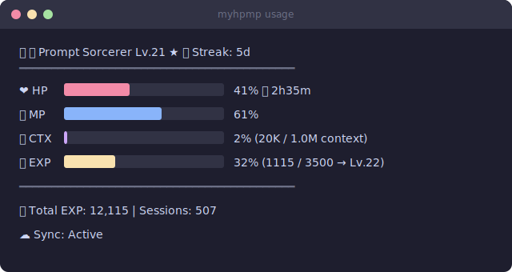

# @myhpmp/cli

[한국어](./README.ko.md) | English

RPG-style gamified usage dashboard for Claude Code.

Turn your Claude Code usage into a game — track your level, HP, MP, EXP, streaks, and earn titles as you code.

<p align="center">
  
</p>

## Quick Start

```bash
npm install -g @myhpmp/cli
```

### 1. Install hooks

```bash
myhpmp setup
```

This installs Claude Code hooks that automatically track your usage. A real-time status line appears at the bottom of Claude Code.

### 2. Set your language

```bash
myhpmp locale
```

Supports Korean and English. Auto-detects from system locale if skipped.

### 3. Restart Claude Code

That's it. EXP tracking starts automatically on your next session.

### 4. (Optional) Enable cloud sync

```bash
myhpmp init
```

Sync stats across devices via GitHub or Google OAuth. Your RPG progress follows you everywhere.

## Dashboard

Run `myhpmp usage` for the full RPG dashboard:

<p align="center">
  
</p>

## Stats

| Stat | Description |
|------|-------------|
| **❤️ HP** | 5-hour rate limit remaining (%) + reset timer |
| **💙 MP** | 7-day weekly limit remaining (%) + reset timer |
| **🧠 CTX** | Current context window usage (%) |
| **🔥 Streak** | Consecutive days of usage |
| **⭐ EXP** | Experience points toward next level |

## Level Tiers

| Level | Title | EXP/Level | Cumulative |
|-------|-------|-----------|------------|
| 1-5 | 🌱 Prompt Newbie | 100 | 500 |
| 6-10 | ⚔️ Token Explorer | 300 | 2,000 |
| 11-15 | 🛠️ Prompt Engineer | 600 | 5,000 |
| 16-20 | 🏗️ Context Architect | 1,200 | 11,000 |
| 21-30 | 🔮 Prompt Sorcerer | 3,500 | 46,000 |
| 31-40 | 👑 Model Master | 8,000 | 126,000 |
| 41-50 | 🐉 Context Overlord | 15,000 | 276,000 |
| 50+ | ⚡ Synthetic Mind | 25,000 | ∞ |

Early levels fly by. Late tiers require serious dedication.

## EXP Sources

| Action | EXP |
|--------|-----|
| Token usage | 1 EXP per 1K tokens |
| Session complete | 25 EXP |
| Streak bonus | streak days × 5 EXP (cap: 30 days = 150 max) |
| Weekly 70%+ usage | 100 EXP |

## Commands

| Command | Description |
|---------|-------------|
| `myhpmp setup` | Auto-configure hooks (Claude Code) |
| `myhpmp usage` | Show detailed RPG dashboard |
| `myhpmp sync` | Manually sync stats to cloud |
| `myhpmp statusline` | Toggle status line on/off |
| `myhpmp locale` | Change display language (한국어/English) |
| `myhpmp init` | Set up authentication (cross-device sync) |
| `myhpmp uninstall` | Remove all hooks and optionally local data |

## Cross-Device Sync

Sync your stats (level, EXP, streaks) across multiple machines:

```bash
myhpmp init
```

Supports **GitHub OAuth** and **Google OAuth**.

| Timing | Behavior |
|--------|----------|
| Session start | Pull latest from cloud |
| Every 5 minutes | Auto-sync during active use |
| Session end | Push final stats to cloud |
| `myhpmp sync` | Manual sync on demand |

Data is stored locally at `~/.myhpmp/data.json` and works fully offline. Cloud sync is best-effort — local data is always preserved.

## Customization

### Status line order

Customize which segments appear and in what order via `~/.myhpmp/config.json`:

```json
{
  "statusLineOrder": ["title", "hp", "mp", "ctx", "streak", "project"]
}
```

Available segments: `title`, `hp`, `mp`, `ctx`, `streak`, `project`

### i18n

```
KO: 🔮 프롬프트 소서러 Lv.21 ★ | ❤️ 80% ⏱️4h34m | 💙 64% ⏱️5일 | 🧠 2% | 🔥5일 | 📂 ~/…/myhpmp-cli (main*)
EN: 🔮 Prompt Sorcerer Lv.21 ★ | ❤️ 80% ⏱️4h34m | 💙 64% ⏱️5d | 🧠 2% | 🔥5d | 📂 ~/…/myhpmp-cli (main*)
```

## Requirements

- Node.js >= 18
- Claude Code (Pro/Max subscription)

## Supported Platforms

- **Windows** / **macOS** / **Linux**

## License

MIT
